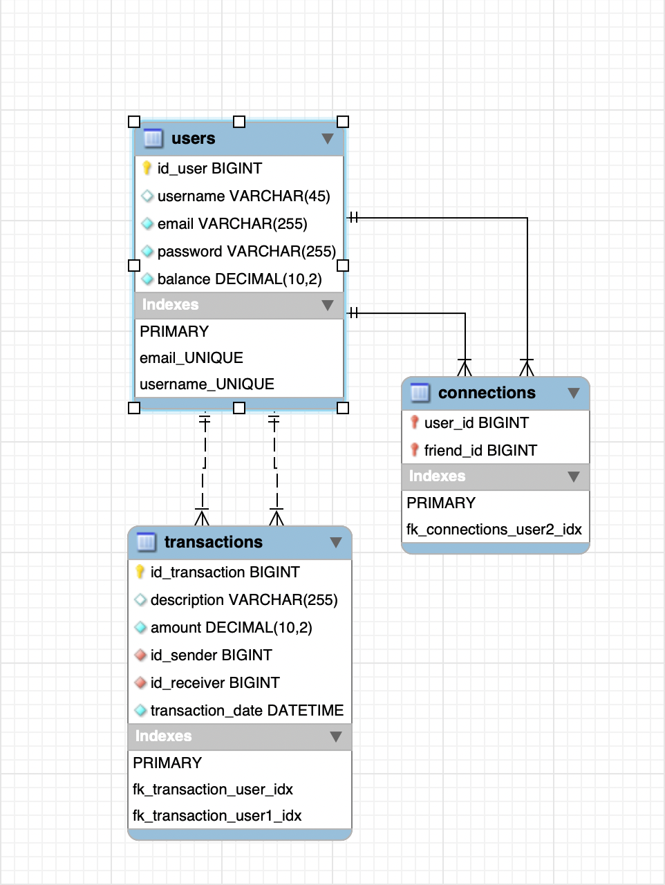

# Pay My Buddy

Spring Boot API enabling money transactions between users.

---

## Getting Started

These instructions allow you to retrieve and run the project
for development or testing.

### Prerequisites

Required software :

- Java 21.0.9
- Spring 4.0.0
- Maven 3.9.11
- MySQL 9.5.0
- MySQL Workbench 8.0.45 if necessary

### Installing

1 - Install Java : https://www.oracle.com/java/technologies/downloads/#java21.

2 - Install Maven : https://maven.apache.org/install.html.

3 - Install MySQL : https://dev.mysql.com/downloads/mysql/.

4 - Install MySQL Workbench : https://dev.mysql.com/downloads/workbench/.

3 - Clone the project on your local machine.

### Importing the DB

1 - Create a new mySQL database using the script "PMB.sql" available in the 'docs' folder.

### Running the app

1 - Run the app PayMyBuddyApplication.java via your IDE.

2 - On your browser, go to http://localhost:8080/.

OR 

Follow these steps :

1 - Open a terminal and go to the project folder.

2 - Enter the command "mvn spring-boot:run".

3 - On your browser, go to http://localhost:8080/.

### Testing the app

Via your IDE, right-click on the root folder and select "Run all tests".

OR

Enter the command "mvn clean test" on the terminal.

### Reports

For Jacoco report, enter the command "mvn test" on the terminal.

For Surefire report, enter the command "mvn surefire-report:report" on the terminal.

## PMD

